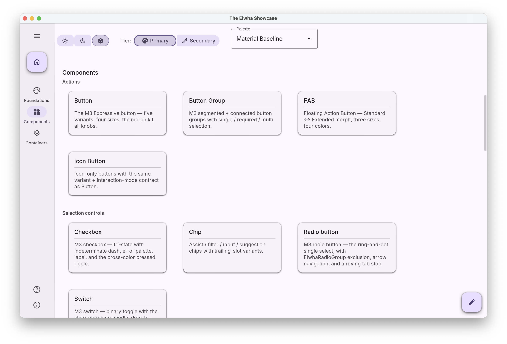

# Elwha

[](LICENSE)
[](https://openjdk.org/projects/jdk/21/)
[](https://www.formdev.com/flatlaf/)

**Elwha brings Material 3 Expressive to desktop Java.** It is a Swing component library built on
[FlatLaf](https://www.formdev.com/flatlaf/): a design-token foundation, about 25 components, and
the containers, overlays and anchors that go around them — cards, chips, dialogs, menus, tooltips,
side sheets, app bars, navigation rails, tabs, sliders, a color picker, and the rest.

The tokens are the point. Color roles, shape and type scales, spacing steps and state-layer
overlays are written into `UIManager` by a single install call, and every component resolves them
at paint time — Elwha's components *and* the plain `JButton`s and `JTextField`s you already have.
Consistency holds because there is one vocabulary, not because everyone remembered the hex code.

> The Elwha is a Pacific Northwest river restored after the largest dam removal in US history — the
> name puts the library on [Open Water Systems](https://openwatersystems.com)' clean-water mission.



*The Elwha Showcase's Components landing. To explore every component live, run the downloadable
Showcase jar (see [Seeing everything](#seeing-everything) below).*

## Install

Elwha publishes to **GitHub Packages**, which requires an authenticated request even for public
artifacts. (To just *see* the components before deciding, skip all of this — the Showcase is a
downloadable jar; see [Seeing everything](#seeing-everything).) The library is the single
coordinate `com.owspfm:elwha`. Add the repository and the dependency:

```xml
<repositories>
  <repository>
    <id>github-elwha</id>
    <url>https://maven.pkg.github.com/OWS-PFMS/elwha</url>
  </repository>
</repositories>

<dependencies>
  <dependency>
    <groupId>com.owspfm</groupId>
    <artifactId>elwha</artifactId>
    <version>1.1.1</version>
  </dependency>
</dependencies>
```

…then put a GitHub personal access token with the **`read:packages`** scope in `~/.m2/settings.xml`
under a matching server id:

```xml
<servers>
  <server>
    <id>github-elwha</id>
    <username>YOUR_GITHUB_USERNAME</username>
    <password>YOUR_PAT_WITH_READ_PACKAGES</password>
  </server>
</servers>
```

Mismatched ids are the usual cause of a first-time `401`. Full walkthrough, Gradle setup and
troubleshooting: **[docs/consumer/install.md](docs/consumer/install.md)**.

## Quick start

Install the theme before you build any UI — that call installs FlatLaf, selects a palette, and
writes the tokens every component reads.

```java
import com.owspfm.elwha.button.ElwhaButton;
import com.owspfm.elwha.card.ElwhaCard;
import com.owspfm.elwha.card.ElwhaCardHeader;
import com.owspfm.elwha.card.ElwhaCardSupportingText;
import com.owspfm.elwha.theme.ElwhaTheme;
import com.owspfm.elwha.theme.MaterialPalettes;
import com.owspfm.elwha.theme.Mode;
import java.awt.BorderLayout;
import javax.swing.JFrame;
import javax.swing.SwingUtilities;

public final class ReadmeSnippet {

  public static void main(String[] args) {
    SwingUtilities.invokeLater(
        () -> {
          // Install the theme before creating any UI.
          ElwhaTheme.install(
              ElwhaTheme.config()
                  .theme(MaterialPalettes.baseline())
                  .mode(Mode.SYSTEM)
                  .build());

          ElwhaCard card = ElwhaCard.elevatedCard();
          card.add(new ElwhaCardHeader().setTitle("Recent activity").setSubtitle("Last 30 days"));
          card.add(new ElwhaCardSupportingText("12 cycles found across 4 factors."));

          JFrame frame = new JFrame("Elwha");
          frame.setDefaultCloseOperation(JFrame.EXIT_ON_CLOSE);
          frame.add(card, BorderLayout.CENTER);
          frame.add(ElwhaButton.filledButton("Refresh"), BorderLayout.SOUTH);
          frame.setSize(400, 240);
          frame.setLocationRelativeTo(null);
          frame.setVisible(true);
        });
  }
}
```

`Mode.SYSTEM` follows the OS appearance. Switch at runtime with
`ElwhaTheme.install(ElwhaTheme.current().withMode(Mode.DARK))`.

A longer walkthrough — what each call does, how raw Swing inherits the theme, runtime mode
switching: **[docs/consumer/quick-start.md](docs/consumer/quick-start.md)**.

## Documentation

| | |
|---|---|
| **[API reference](https://ows-pfms.github.io/elwha/)** | The full Javadoc, redeployed on every push to `main`. |
| **[Install & authenticate](docs/consumer/install.md)** | Coordinates, the `read:packages` token flow, Gradle, and the 401/403 troubleshooting list. |
| **[Quick start](docs/consumer/quick-start.md)** | A program that compiles, annotated. |
| **[Theming](docs/consumer/theming.md)** | The token families, dark mode, the bundled palette tiers, shipping your own palette, typography. |
| **[Component index](docs/consumer/components.md)** | Every component, its class, and where to see it in the Showcase. |
| **[Stability policy](docs/consumer/stability.md)** | What 1.x promises, what counts as public API, the deprecation policy, and upgrading from 0.1.0. |

## What's in the box

| Family | Components |
|---|---|
| **Foundations** | Design tokens (`ColorRole`, `ShapeScale`, `SpaceScale`, `TypeRole`, `StateLayer`), `ElwhaTheme` install API, `ElwhaSurface`, `MaterialIcons` |
| **Actions** | `ElwhaButton`, `ElwhaIconButton`, `ElwhaButtonGroup`, `ElwhaFab` + `ElwhaFabAnchor` |
| **Selection controls** | `ElwhaCheckbox`, `ElwhaRadioButton` + `ElwhaRadioGroup`, `ElwhaSwitch`, `ElwhaChip` |
| **Fields** | `ElwhaTextField`, `ElwhaSelectField<T>`, `ElwhaSlider`, `ElwhaColorPicker` (+ dialog and popover) |
| **Containers & surfaces** | `ElwhaCard` and its composition primitives, `ElwhaItemList<T>`, `ElwhaSideSheet` |
| **Overlays** | `ElwhaDialog`, `ElwhaFullScreenDialog`, `ElwhaMenu`, `ElwhaTooltip` |
| **Navigation** | `ElwhaAppBar`, `ElwhaNavigationRail` + `ElwhaNavRailDestination`, `ElwhaTabs` |
| **Feedback** | `ElwhaBadge` + `ElwhaBadgeAnchor`, `ElwhaLinearProgressIndicator`, `ElwhaCircularProgressIndicator`, `ElwhaLoadingIndicator` |

One-line descriptions, Javadoc links and Showcase leaves for all of them:
**[docs/consumer/components.md](docs/consumer/components.md)**. Full API reference:
**[ows-pfms.github.io/elwha](https://ows-pfms.github.io/elwha/)**.

## Theming in one paragraph

`MaterialPalettes` ships the M3 baseline scheme plus two tiers of demo palettes, discovered from
resource directories rather than a hardcoded list. A `Theme` carries both a light and a dark
`Palette`, so dark mode is a `Mode`, not a second theme. To ship your own colors, write an
Elwha-format palette JSON (49 color roles, light and dark) and load it with
`PaletteLoader.loadTheme(...)`; `scripts/convert_mtb_palette.py` converts a Material Theme Builder
export into that format. Full guide: **[docs/consumer/theming.md](docs/consumer/theming.md)**.

## Seeing everything

Every shipped component has a leaf in **The Elwha Showcase**, and the Showcase is a download, not
a build: grab the self-contained `elwha-showcase-<version>-app.jar` from the
[releases page](https://github.com/OWS-PFMS/elwha/releases) — it is attached to every release from
1.1.0 on — and run it. No clone, no Maven, no Packages token; a JDK 21+ is the only requirement.

```bash
java -jar elwha-showcase-<version>-app.jar
```

The Showcase and the per-component playgrounds ship as their own artifact, `elwha-showcase` — none
of it is inside the `com.owspfm:elwha` jar your build depends on (see the
[stability policy](docs/consumer/stability.md#the-elwha-showcase-artifact)). From a checkout the
same storefront runs with `mvn compile exec:java` (the Showcase is the default main class), and
around thirty per-component playgrounds live alongside it — for example:

```bash
mvn compile exec:java -Dexec.mainClass="com.owspfm.elwha.theme.playground.ThemePlayground"
mvn compile exec:java -Dexec.mainClass="com.owspfm.elwha.card.playground.ElwhaCardPlayground"
mvn compile exec:java -Dexec.mainClass="com.owspfm.elwha.chip.ElwhaChipPlayground"
```

## Requirements

- **JDK 21** or later (bytecode 65 — JDK 17 cannot load the jar)
- **Swing** — no JavaFX, no Compose, no AWT-only fallback
- **FlatLaf 3.2.5** (`flatlaf`, `flatlaf-extras`) and `jsvg`, pulled
  in transitively

Elwha depends on Swing and the FlatLaf family only — no app framework, no logging facade, no
domain types. The exact compile-scope set lives in
[Dependency stance](docs/consumer/stability.md#dependency-stance).

## Stability

From 1.0.0 the API follows semantic versioning: `1.x` minors are additive, patches are fixes only,
and anything slated for removal is deprecated for the rest of the 1.x line first. Elwha implements
Material 3 Expressive closely but is not spec-compliant; each component's design doc under
`docs/research/` records its deliberate divergences. Details:
**[docs/consumer/stability.md](docs/consumer/stability.md)**.

## Contributing

See [CONTRIBUTING.md](CONTRIBUTING.md). Maintainer-facing conventions — code style, Javadoc and
`@version` rules, the changelog policy — live in [`docs/development/`](docs/development/).

## License

Apache License, Version 2.0 — see [LICENSE](LICENSE). Bundled third-party assets (Material Symbols,
the Inter font) carry their own licenses; see [`NOTICE`](NOTICE).
