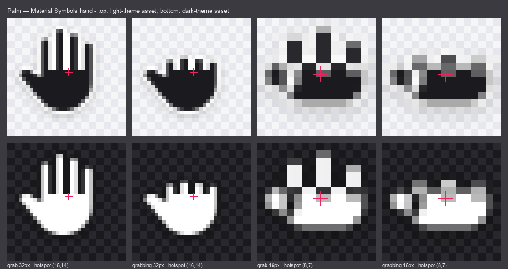
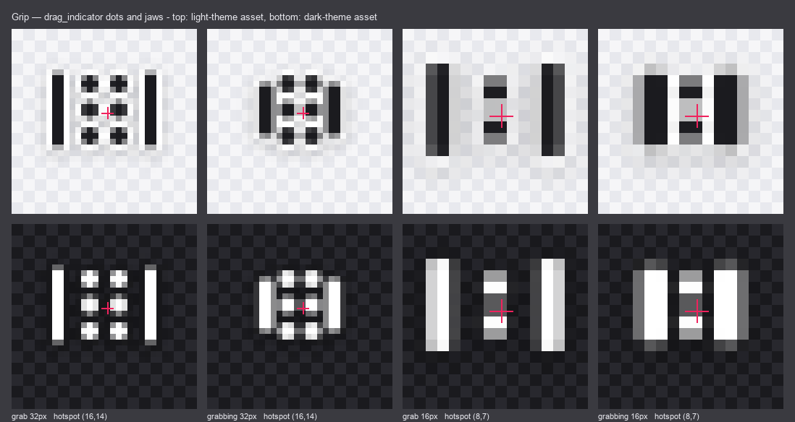
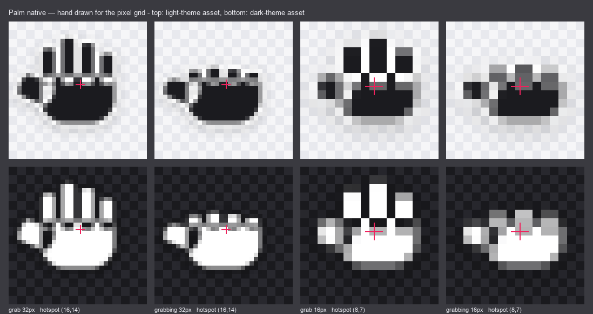
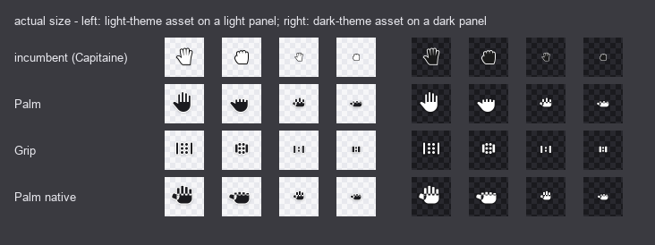
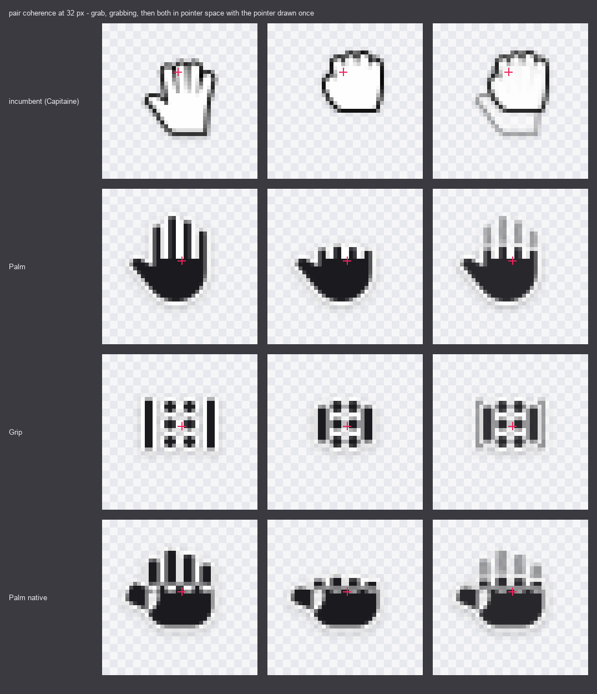
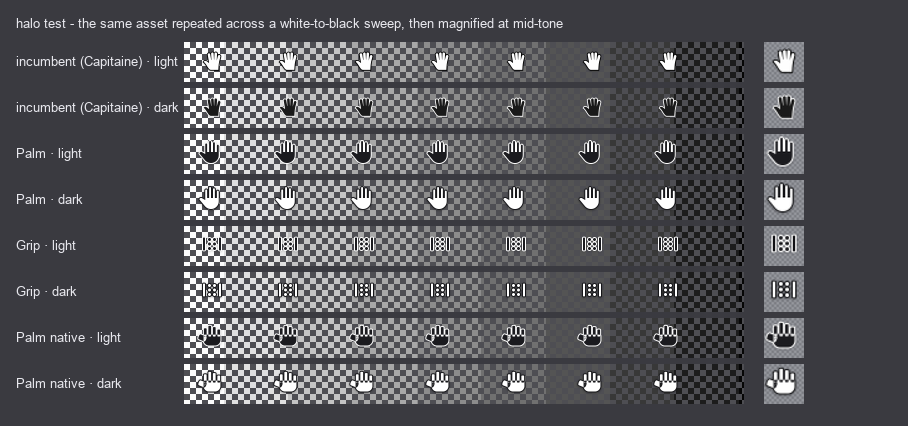
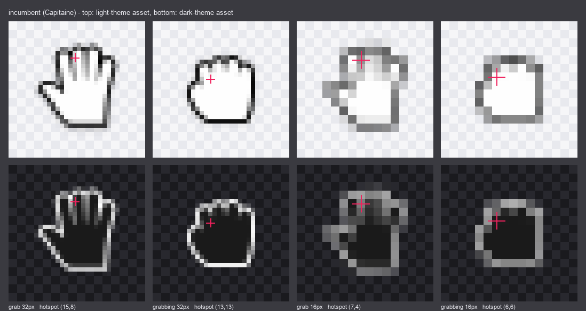

# Reorder cursor redesign — candidate review (#531)

**Status:** candidates for operator review. Nothing is swapped in.
**Issue:** [#531](https://github.com/OWS-PFMS/elwha/issues/531) · **Milestone:** v0.5.0
**Branch:** `design/531-cursor-redesign`

Issue #531 is a licensing defect: `NOTICE` declares the bundled Capitaine reorder
cursors as CC BY-SA 4.0 while the `LICENSE-capitaine.txt` shipped beside them says
LGPL-3.0, and `v0.1.0` published both the assets and the wrong notice. The
operator-directed resolution is option 2 — **replace the assets with an original
set** — so that the swap PR can state one true license instead of correcting a
contradiction.

This document is the design half of that. It contains three complete candidate
sets, the evidence behind each decision, and a ranked recommendation. It changes
nothing under `src/main`, and it does not touch `NOTICE` or
`LICENSE-capitaine.txt` — those belong to the swap PR, as one deliberate change.

Everything here is regenerable:

| Path | What it is |
|---|---|
| `assets/531/cursorforge.py` | the rasteriser: SVG path parser, supersampled scanline fill, halo by distance transform, SVG emitter |
| `assets/531/candidates.py` | the geometry of all three candidates, with the grid budget each one works to |
| `assets/531/render.py` | the build: writes every asset, every review strip, and fails if any candidate's halo would clip |
| `assets/531/candidates/<key>/` | the deliverable assets — 8 PNGs and 8 SVGs per candidate, filenames matching the incumbent exactly |
| `assets/531/review/` | the strips embedded below |
| `assets/531/VerifyCursorAssets.java` | loads every PNG the way `ReorderCursors` does and hands it to `Toolkit.createCustomCursor` |

```bash
python3 docs/research/assets/531/render.py            # regenerate assets + strips
java docs/research/assets/531/VerifyCursorAssets.java docs/research/assets/531
```

---

## 1. What the incumbent actually does, and where it fails

Worth establishing precisely, because the replacement has to satisfy the same
loader and because two of these defects are worth fixing while the assets are
being replaced anyway.

**The mechanism.** Each cursor is a filled silhouette with a roughly 1 px
contrasting outline and a soft, low-alpha drop shadow. The finger separations are
not drawn — they are gaps in the silhouette through which the outline colour
shows. The two theme variants are provably **one drawing with the fill swapped**:
the light and dark PNGs have byte-identical alpha channels at every size, and the
opaque body is `#FEFEFE` in the `-light-` files and `#1A1A1A` in the `-dark-`
ones. That is a good mechanism and the redesign keeps it.

**Defect 1 — the theme mapping is inverted.** `ReorderCursors.loadCursor` builds
its filename with `themeKey = dark ? "dark" : "light"`, so a dark theme loads
`grab-dark-32.png`, whose body is `#1A1A1A` — within a few units of a typical
dark panel background. A light theme loads the `#FEFEFE` body onto a near-white
panel. In both cases the entire silhouette is carried by a 1 px outline. The
`ground-test.png` strip in §5 shows this directly: the incumbent's light variant
all but vanishes at the white end of the sweep and its dark variant vanishes at
the black end, while every candidate holds across the whole range.

The fix costs nothing and needs no code change: author `*-light-*` as **dark body
with a light halo** and `*-dark-*` as **light body with a dark halo**. The
existing loader then picks the high-contrast variant for each theme. Reviewers
diffing the PNGs should expect the artwork's polarity to look swapped relative to
the incumbent — that is the correction, not a mistake.

(Related but separate: the Java2D `paintFallback` path is theme-independent, always
white-on-black, so it happens to be right in dark themes and wrong in light ones.
It only runs if the PNGs fail to decode. Noted in §8.)

**Defect 2 — the pair jumps on mouse-press.** The two hotspots are
`new Point(15, 8)` for grab and `new Point(13, 13)` for grabbing — a delta of
(2, 5) design units. A cursor image with hotspot `h` is drawn with its top-left at
`pointer − h`, so under a stationary pointer the fist's artwork lands 2 px right
and 5 px up from where the open hand's was. The third panel of the incumbent row
in `transition.png` shows the displacement. Nothing in the two drawings
compensates for it, so pressing the mouse makes the hand hop.

They also scale inexactly. `loadCursor` computes `hotspot * size / 32` in integer
arithmetic, and both incumbent hotspots have odd components, so at 16 px (15, 8)
truncates to (7, 4) and (13, 13) to (6, 6) — each losing half a pixel.

**Defect 3 — craft.** The closed state has no knuckle definition at all; at 32 px
it is a rounded blob, and at 16 px it is a rounded square. Both 16 px assets are
soft enough that the hand is hard to identify. See `detail-incumbent.png` below.

---

## 2. The constraints a replacement has to satisfy

**The loader contract** (`list/ReorderCursors.java`), which the candidates match
so a swap is a file copy:

- Filenames are `{grab,grabbing}-{light,dark}-{16,32}.png`, resolved against
  `cursors/` beside the class.
- `bestCursorSize()` asks the toolkit for 32×32 and `pickBestImage` prefers the
  32 px asset whenever the answer is ≥ 24. On the macOS box used here
  `getBestCursorSize(32,32)` returns 32×32, so **the 32 px asset is what actually
  renders**, and 16 px is a fallback for toolkits that cap lower. Effort is
  weighted accordingly: 32 px is where the design has to be excellent, 16 px has
  to be competent.
- Hotspots are authored on a 32-unit design grid and scaled with integer division.

**The grid budget**, calibrated by measuring what the incumbent survives and by
rendering candidates until features stopped resolving:

| | halo | min body feature | min gap |
|---|---|---|---|
| 32 px | 1.0 px | 2 px | 1.0 px |
| 16 px | 0.75 px | 2 px | 1.0 px |

A gap narrower than twice the halo fills with halo colour instead of showing
background. That is not a tolerance being exceeded — it is the mechanism that
turns the space between two fingers into a crisp separator line, and every
candidate uses it deliberately.

---

## 3. How these were made

The previous attempt at this issue was rejected as hand-drawn. Nothing here is
drawn by hand or edited pixel by pixel.

Each candidate is **vector geometry authored once** on a 32-unit grid and emitted
two ways from that single source: an `.svg` and the `.png` rasters. Rendering has
three layers painted bottom-up — a Gaussian-blurred offset shadow, the halo, then
the body. The halo is a **Euclidean dilation** of the body by `halo_px`, which is
exactly what a round-join stroke of width `2 × halo_px` under
`paint-order: stroke` draws, so the emitted SVG and the emitted PNG agree by
construction rather than by eye. Dilating the *union* of the subpaths is what
produces the interior separators for free.

Antialiasing is box-filtered supersampling: fill a binary mask with the nonzero
winding rule at 16× the target size, then average — 256 samples per output pixel,
exact area coverage, no ringing.

`render.py` measures every candidate's extent including its halo and **fails the
build if anything leaves the 32-unit grid.** It caught real clipping twice: both
16 px hands originally overflowed their own image on the left.

---

## 4. The candidates

All three share one hotspot decision: **(16, 14), unified across both states.**
Unified, because a pair whose hotspots differ makes the artwork hop on press
unless the two drawings compensate for the delta — and for an open hand there is
no room to compensate, since placing the knuckle line at y = 8 would push the
fingertips off the top of the image. Both coordinates are **even** so
`hotspot × 16 / 32` stays exact at 16 px, which the incumbent's odd coordinates
do not. Adopting any candidate means changing two literals in
`ReorderCursors.java` (lines 84 and 103) to `new Point(16, 14)`.

### A. `a-palm-m3` — Palm, Material Symbols hand



At 32 px this is the Material Symbols Rounded **`back_hand` fill-1** outline
verbatim (Apache 2.0, Google), scaled by 22/864 and positioned so its knuckle
line — the `h80` seam where all four fingers meet the palm — lands on the
hotspot. Nothing authored by hand matched it, and several attempts are in the
history of this branch.

Its proportions are marginal at cursor size and worth stating: the glyph's fingers
are 72/960 em wide with 80/960 gaps, which at this scale is **2.2 px fingers
separated by 2.4 px**. With a 1 px halo on each flank the gaps flood completely,
so the hand reads as four dark bars on a light slab. At 32 px that resolves and
looks good. At 16 px it does not, which is why the sizes are different drawings.

**The closed state is not a second drawing.** It is a piecewise vertical warp of
the open state: everything above the knuckle seam collapses to 30 % of its height,
everything at or below it is untouched. Finger widths, gaps and cap radii survive
exactly, the seam stays continuous so no gap opens, and the round fingertips
squash into ellipses that read as curled knuckles. The pair is therefore provably
the same hand in two poses, and because the palm is bit-identical between states,
the transition reads as fingers closing rather than as a cursor swap. 0.30 is the
shallowest curl where the four knuckles still read separately; below that they
merge into one bar.

At 16 px the drawing keeps Material's **finger-to-gap proportion** (1.9 px fingers
separated by 2.1 px, the glyph's own 1:1.1) and drops to three fingers to afford
it. Four fingers do fit in the width, but only at 0.85 px gaps, which antialias to
grey — that variant was rendered and rejected; see §6.

**Hotspot:** (16, 14), on the knuckle line at the palm's midpoint.
**Licence the swap can state:** derived from Material Symbols (Apache 2.0,
Google), already attributed in `NOTICE` for the bundled icon set, plus original
work by Charles Bryan for the 16 px drawing and both closed states.

### B. `b-grip-dots` — Grip, drag_indicator dots and jaws



Not a hand. The open state is `drag_indicator`'s 2×3 dot grid — at the glyph's own
diameter-to-pitch ratios, 1.667 across and 1.500 down — flanked by two vertical
jaws. The closed state draws the jaws in, shortens and thickens them, and squeezes
the dot columns; dot diameter never changes, so the two states are unmistakably
the same object being clamped.

The systemic argument for this one is real: `ElwhaItemList`'s own drag handle draws
`drag_indicator`, so the cursor and the affordance it hovers over would be the same
motif. It is also the crispest candidate at both sizes, since dots and bars are the
two shapes a pixel grid handles best, and it has no antialiasing artefacts anywhere.

Its cost is semantic. Hands are the universal convention for grab and grabbing —
CSS names the cursors that, and every desktop ships them — and two bars with dots
between them reads as "grip" or, less helpfully, as a column-resize cursor.

**16 px compromise, disclosed:** 14 usable pixels cannot hold six dots *and* jaws
with room to visibly travel. The dot block degrades from 2×3 to a single column of
two — still enough to read as the drag handle — and the jaws keep their full range,
because they are what carries the state change. Three alternatives were rendered and
rejected: a single centre dot the closed state swallows (the state change survives
but the drag-handle reference does not), a squeezed 2×2 block whose jaws overlap the
dots into a blob, and keeping more dots by freezing the jaws.

Curved bracket jaws were also tried at 32 px and looked better there, but arcs turn
to mush at 16 px, so straight jaws won for consistency across sizes.

**Hotspot:** (16, 14), the centre of the dot block, about which the motif is
symmetric.
**Licence the swap can state:** original work by Charles Bryan. Dot diameter and
pitch ratios are measured from Material Symbols `drag_indicator` (Apache 2.0), which
is already bundled and attributed.

### C. `c-palm-native` — Palm native, hand drawn for the pixel grid



A hand built from primitives — round-capped finger bars, a rounded palm, a broad
thumb lobe — with proportions chosen for the grid rather than inherited. Fingers
are 2.8 px at 32 px with 1.7 px gaps, a 1:0.61 ratio against Material's 1:1.09,
which buys a body feature comfortably wider than the halo at both sizes. 16 px runs
three fingers at 2.0 px with 1.0 px separators: same count as candidate A, visibly
heavier weight. The closed states use the same curl as A.

Its payoff is the simplest licensing story of the three and no dependence on
third-party outlines. Its cost is craft, and this is the honest compromise in the
set: **the thumb reads as a lobe attached to the palm rather than as one continuous
wedge.** Candidate A does not have that problem because `back_hand` is a single
hand-drawn outline with a smooth concave junction, and a union of a capsule and a
rounded rectangle cannot reproduce that.

Two constraints were learned here and are enforced in the geometry. The thumb tip
must stay at or below the knuckle line, and the thumb base must stay inside the
palm's straight left flank rather than down in its rounded bottom. Violating either
closes the thumb web into an *enclosed* concavity, and since the halo is a dilation
of the whole silhouette, an enclosed concavity narrower than twice the halo fills
with halo colour and reads as a bright hole punched through the hand. Earlier
revisions of this candidate had exactly that; five thumb placements were rendered
to find where the notch opens.

**Hotspot:** (16, 14), as candidate A.
**Licence the swap can state:** original work by Charles Bryan. Finger-length
ratios are shared with candidate A; they describe hand anatomy rather than the
glyph's expression, and are disclosed for completeness.

---

## 5. Side by side

**Actual size.** The view that matters, and the one that flatters least. Left half
is each set's light-theme asset on a light panel; right half is the dark-theme
asset on a dark panel.



**Pair coherence.** Grab, grabbing, then both composited in *pointer* space with
the pointer drawn once — each state offset by its own hotspot, which is what the
user experiences. Any displacement in the third panel is displacement they see on
mouse-press. The incumbent's fist is visibly off; all three candidates hold still.



**Halo test.** The same asset repeated across a banded white-to-black sweep. A
cursor legible across the whole width has a halo that works — this is what the
cursor has to survive over content, imagery, or a half-tone selection fill.



**Incumbent, same treatment,** for comparison. Note its own hotspots are marked,
not the unified one.



---

## 6. Findings worth keeping whichever candidate wins

1. **32 px is the asset that ships; 16 px is a fallback.** `getBestCursorSize`
   returns 32×32 on macOS, and `pickBestImage` prefers 32 px whenever the toolkit
   answers ≥ 24. Design effort belongs at 32 px.
2. **16 px is a redraw, not a downscale.** Every attempt to scale a 32 px hand to
   16 px produced grey mush. Both hand candidates author the two sizes separately.
3. **Material Symbols fill-1 geometry is the right starting point; fill-0 is not.**
   The outline style's stroke weight is 2.4 px at 32 px and 1.2 px at 16 px, which
   cannot carry a contrast halo at all. A cursor is a different artifact class from
   a 20 dp UI icon, and this is a deliberate, narrow divergence from the house
   fill-0 convention — documented here rather than assumed.
4. **Finger aspect ratio is the parameter that decides whether a hand reads as a
   hand.** Below roughly 1:3.5 width-to-length the fingers read as toes and the
   whole silhouette reads as a paw, no matter what else is right. Several early
   revisions failed on this alone.
5. **The halo fills concavities, so enclosed concavities become bright holes.**
   Any junction between primitives narrower than twice the halo has to be either
   comfortably wide or open to the outside.
6. **Pick even hotspot coordinates.** Integer `hotspot × size / 32` scaling is then
   exact at 16 px.
7. **Author `-light-` as dark-on-light and `-dark-` as light-on-dark.** The
   existing loader then picks the high-contrast variant per theme with no code
   change.

---

## 7. Recommendation

**Ranked: A, then C, then B.**

**A — `a-palm-m3`.** The best-looking artwork at the size that actually renders,
and the only 32 px silhouette in this exercise that hand-authoring could not match.
Its provenance is a sanctioned direction: `back_hand` is Apache 2.0 from the same
Material Symbols family already bundled and attributed in `NOTICE`, so the swap PR
states one license for artwork and icons alike. Its closed state is the strongest
of the three — the palm is bit-identical between poses, so the press reads as
fingers closing. It keeps the OS-wide hand convention for grab and grabbing.

**C — `c-palm-native`.** Take this if the preference is zero third-party outline
geometry, which makes the licensing story a single line. It is close to A and has
no rendering artefacts, but its thumb reads as an attached lobe rather than a
continuous wedge, and at 32 px that gap against A is visible in the detail strips.

**B — `b-grip-dots`.** The best pure craft in the set — crispest at both sizes, no
artefacts, and a genuine coherence argument in that the cursor would echo the drag
handle it hovers. It ranks third only because it abandons the hand convention, which
is a usability cost on the one job the cursor has. **Pick B over the hands if system
coherence with `drag_indicator` is worth more than convention** — that is a product
call, not a craft one, which is why it is here rather than filtered out.

**One option worth knowing about:** the 32 px and 16 px assets are independent,
because the toolkit only ever loads one. Mixing is legal — for example A's 32 px
with C's 16 px drawing — and both are already in the repo. My own preference is
plain A; the 16 px drawings of A and C are close enough that mixing buys little.

### What to look at to decide

1. `review/actual-size.png` first, at 100 % zoom. If a candidate does not work
   there, nothing else matters.
2. `review/transition.png`, third panel per row. This is the behaviour the
   incumbent gets wrong.
3. `review/detail-a-palm-m3.png` against `review/detail-c-palm-native.png`, top-left
   cell of each. That is the A-versus-C decision: Material's continuous thumb-wrist
   wedge against the native drawing's thumb lobe.
4. `review/ground-test.png` if the halo weight is in question.

For a live look rather than strips, the fastest route is to point `ReorderCursors`
at a candidate directory in a scratch branch and hover a reorderable
`ElwhaItemList` — the filenames match, so it is a copy and the two hotspot
literals.

---

## 8. What the swap PR still has to do

Out of scope here, deliberately. Recorded so it is not rediscovered:

- [ ] Copy the chosen candidate's 8 PNGs to
      `src/main/resources/com/owspfm/elwha/list/cursors/`.
- [ ] Change both hotspot literals in `ReorderCursors.java` (lines 84, 103) to
      `new Point(16, 14)`, and bump its `@version`.
- [ ] Delete `LICENSE-capitaine.txt`.
- [ ] Rewrite the `NOTICE` entry: one true license, a path that resolves. The
      current entry is wrong on both counts (#531 acceptance criteria).
- [ ] Update the `CLAUDE.md` bundled-resources row, which repeats both errors, and
      drop the "license in dispute" caveat.
- [ ] Confirm `README.md`'s license section, which defers to `NOTICE` generically.
- [ ] Decide whether the Java2D `paintFallback` silhouettes in `ReorderCursors`
      should be redrawn to match the new artwork. They are theme-independent
      (always white body, black outline) and only run if the PNGs fail to decode,
      so this is cosmetic — but leaving a mismatched shape in the fallback is the
      kind of thing a later reviewer files.
- [ ] `CHANGELOG.md` under `## [Unreleased]`: asset replacement and the hotspot
      change are both user-visible.

The `#67` / `#96` interaction the issue flagged is already settled — `ReorderCursors`
lives at `list/` now and no longer imports anything from `card/v1`, so the asset
home is decided and nothing here blocks it.
